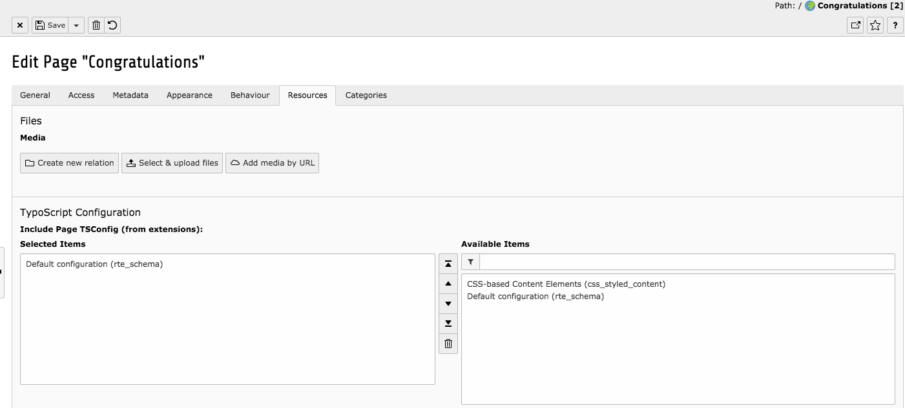
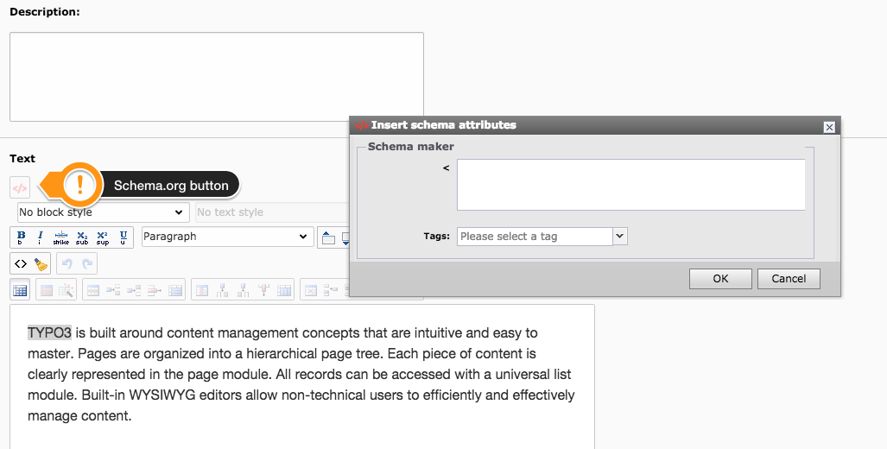

.. ==================================================
.. FOR YOUR INFORMATION
.. --------------------------------------------------
.. -*- coding: utf-8 -*- with BOM.

.. include:: ../Includes.txt

.. _users-manual:

Users manual
============

- Install the extension using the Extension Manager
- Add the static Page TSConfig (typoscript) to your typoscript template

	Default Backend view for TSCONFIG

	Select text and click on top button

**Custom RTE**

.. code-block:: xml

	RTE.default{
		buttons.schemaattr.allowTags = span
	}
